# Entity Relationship Model (ERM) Diagram - Streetcode Project

This diagram illustrates the database structure and relationships between entities in the Streetcode application.

## Mermaid ERM Diagram

```mermaid
---
config:
  look: neo
  layout: elk
---
erDiagram
	direction TB
	StreetcodeContent {
		int Id PK ""  
		int Index UK ""  
		string Teaser  ""  
		string DateString  ""  
		string Alias  ""  
		enum Status  ""  
		string Title  ""  
		string TransliterationUrl UK ""  
		string ShortDescription  ""  
		int ViewCount  ""  
		datetime CreatedAt  ""  
		datetime UpdatedAt  ""  
		datetime EventStartOrPersonBirthDate  ""  
		datetime EventEndOrPersonDeathDate  ""  
		int AudioId FK ""  
	}

	User {
		int Id PK ""  
		string Name  ""  
		string Surname  ""  
		string Email  ""  
		string Login  ""  
		string Password  ""  
		enum Role  ""  
	}

	Image {
		int Id PK ""  
		string BlobName  ""  
		string MimeType  ""  
		string Base64  ""  
	}

	Audio {
		int Id PK ""  
		string Title  ""  
		string BlobName  ""  
		string MimeType  ""  
		string Base64  ""  
	}

	Video {
		int Id PK ""  
		string Title  ""  
		string Description  ""  
		string Url  ""  
		int StreetcodeId FK ""  
	}

	Art {
		int Id PK ""  
		string Description  ""  
		string Title  ""  
		int ImageId FK ""  
	}

	ImageDetails {
		int Id PK ""  
		string Alt  ""  
		string Title  ""  
		int ImageId FK ""  
	}

	Text {
		int Id PK ""  
		string Title  ""  
		string TextContent  ""  
		string AdditionalText  ""  
		string VideoUrl  ""  
		int StreetcodeId FK ""  
	}

	Fact {
		int Id PK ""  
		string Title  ""  
		string FactContent  ""  
		int ImageId FK ""  
		int StreetcodeId FK ""  
		int Order  ""  
	}

	Term {
		int Id PK ""  
		string Title  ""  
		string Description  ""  
	}

	RelatedTerm {
		int Id PK ""  
		string Word  ""  
		int TermId FK ""  
	}

	Response {
		int Id PK ""  
		string Name  ""  
		string Email  ""  
		string Description  ""  
	}

	Tag {
		int Id PK ""  
		string Title  ""  
	}

	Subtitle {
		int Id PK ""  
		string SubtitleText  ""  
		int StreetcodeId FK ""  
	}

	TimelineItem {
		int Id PK ""  
		datetime Date  ""  
		enum DateViewPattern  ""  
		string Title  ""  
		string Description  ""  
		int StreetcodeId FK ""  
	}

	HistoricalContext {
		int Id PK ""  
		string Title  ""  
	}

	HistoricalContextTimeline {
		int HistoricalContextId FK ""  
		int TimelineItemId FK ""  
	}

	Partner {
		int Id PK ""  
		string Title  ""  
		int LogoId FK ""  
		bool IsKeyPartner  ""  
		bool IsVisibleEverywhere  ""  
		string TargetUrl  ""  
		string UrlTitle  ""  
		string Description  ""  
	}

	PartnerSourceLink {
		int Id PK ""  
		enum LogoType  ""  
		string TargetUrl  ""  
		int PartnerId FK ""  
	}

	TeamMember {
		int Id PK ""  
		string FirstName  ""  
		string LastName  ""  
		string Description  ""  
		bool IsMain  ""  
		int ImageId FK ""  
	}

	Positions {
		int Id PK ""  
		string Position  ""  
	}

	TeamMemberLink {
		int Id PK ""  
		string TargetUrl  ""  
		enum LogoType  ""  
		int TeamMemberId FK ""  
	}

	SourceLinkCategory {
		int Id PK ""  
		string Title  ""  
		int ImageId FK ""  
	}

	StreetcodeCategoryContent {
		int Id PK ""  
		string Text  ""  
		int SourceLinkCategoryId FK ""  
		int StreetcodeId FK ""  
	}

	Toponym {
		int Id PK ""  
		string Oblast  ""  
		string AdminRegionOld  ""  
		string AdminRegionNew  ""  
		string Gromada  ""  
		string Community  ""  
		string StreetName  ""  
		string StreetType  ""  
	}

	ToponymCoordinate {
		int Id PK ""  
		decimal Latitude  ""  
		decimal Longitude  ""  
		int ToponymId FK ""  
	}

	StreetcodeToponym {
		int StreetcodeId FK ""  
		int ToponymId FK ""  
	}

	StreetcodeCoordinate {
		int Id PK ""  
		decimal Latitude  ""  
		decimal Longitude  ""  
		int StreetcodeId FK ""  
	}

	StatisticRecord {
		int Id PK ""  
		int QrId  ""  
		int Count  ""  
		string Address  ""  
		int StreetcodeId FK ""  
		int StreetcodeCoordinateId FK ""  
	}

	TransactionLink {
		int Id PK ""  
		string UrlTitle  ""  
		string Url  ""  
		int StreetcodeId FK ""  
	}

	News {
		int Id PK ""  
		string Title  ""  
		string Text  ""  
		string URL UK ""  
		int ImageId FK ""  
		datetime CreationDate  ""  
	}

	StreetcodeTagIndex {
		int StreetcodeId FK ""  
		int TagId FK ""  
		int Index  ""  
	}

	StreetcodeArt {
		int StreetcodeId FK ""  
		int ArtId FK ""  
		int Index  ""  
	}

	RelatedFigure {
		int ObserverId FK ""  
		int TargetId FK ""  
	}

	StreetcodePartner {
		int StreetcodeId FK ""  
		int PartnerId FK ""  
	}

	StreetcodeImage {
		int StreetcodeId FK ""  
		int ImageId FK ""  
	}

	TeamMemberPositions {
		int TeamMemberId FK ""  
		int PositionsId FK ""  
	}

	PersonStreetcode {
		string FirstName  ""  
		string Rank  ""  
		string LastName  ""  
	}

	EventStreetcode {
		string Note  ""  
	}

	Coordinate {
		int Id PK ""  
		decimal Latitude  ""  
		decimal Longtitude  ""  
	}

	Untitled-Entity {

	}

	StreetcodeContent||--o{Video:"has many"
	StreetcodeContent||--o|Audio:"has one"
	StreetcodeContent||--o|Text:"has one"
	StreetcodeContent||--o{Fact:"has many"
	StreetcodeContent||--o{Subtitle:"has many"
	StreetcodeContent||--o{TimelineItem:"has many"
	StreetcodeContent||--o|TransactionLink:"has one"
	StreetcodeContent||--o{StatisticRecord:"has many"
	StreetcodeContent||--o{StreetcodeCoordinate:"has many"
	StreetcodeContent||--o{StreetcodeTagIndex:"  "
	Tag||--o{StreetcodeTagIndex:"  "
	StreetcodeContent||--o{StreetcodeArt:"  "
	Art||--o{StreetcodeArt:"  "
	StreetcodeContent||--o{StreetcodeToponym:"  "
	Toponym||--o{StreetcodeToponym:"  "
	StreetcodeContent||--o{StreetcodeCategoryContent:"  "
	SourceLinkCategory||--o{StreetcodeCategoryContent:"  "
	StreetcodeContent||--o{StreetcodePartner:"  "
	Partner||--o{StreetcodePartner:"  "
	StreetcodeContent||--o{StreetcodeImage:"  "
	Image||--o{StreetcodeImage:"  "
	StreetcodeContent||--o{RelatedFigure:"observes (from)"
	StreetcodeContent||--o{RelatedFigure:"target (to)"
	Image||--o|ImageDetails:"has one"
	Image||--o|Art:"used by"
	Image||--o|Partner:"used by"
	Image||--o|News:"used by"
	Image||--o|TeamMember:"used by"
	Image||--o|SourceLinkCategory:"used by"
	Image||--o{Fact:"used by"
	TimelineItem||--o{HistoricalContextTimeline:"  "
	HistoricalContext||--o{HistoricalContextTimeline:"  "
	Partner||--o{PartnerSourceLink:"has many"
	TeamMember||--o{TeamMemberLink:"has many"
	TeamMember||--o{TeamMemberPositions:"  "
	Positions||--o{TeamMemberPositions:"  "
	Toponym||--o|ToponymCoordinate:"has one"
	StatisticRecord}o--||StreetcodeCoordinate:"references"
	Term||--o{RelatedTerm:"has many"
	StreetcodeContent||--|{PersonStreetcode:"inherits"
	StreetcodeContent||--|{EventStreetcode:"inherits"
	Coordinate||--|{StreetcodeCoordinate:"inherits"
	Coordinate||--|{ToponymCoordinate:"inherits"
	StreetcodeContent}|--|{Untitled-Entity:"  "
```

### Core Schemas:

- **streetcode**: Main streetcode content and related entities
- **users**: User authentication and authorization
- **media**: Images, videos, audio files
- **news**: News articles
- **partners**: Partner organizations
- **team**: Team members and positions
- **timeline**: Historical timeline events
- **sources**: Source link categories
- **toponyms**: Geographic locations and street names
- **transactions**: Payment/donation links
- **coordinates**: Geographic coordinates
- **add_content**: Additional content like tags and subtitles
- **feedback**: User feedback and responses